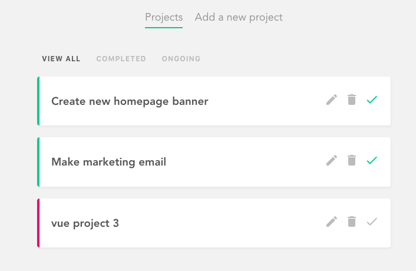
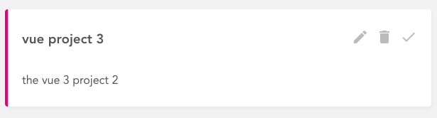
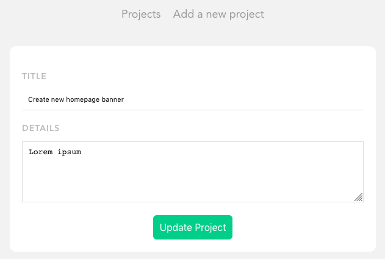
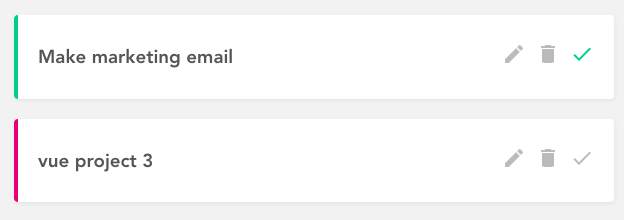
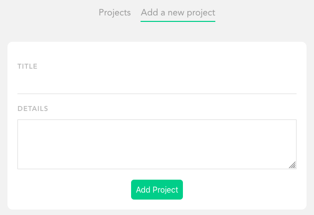
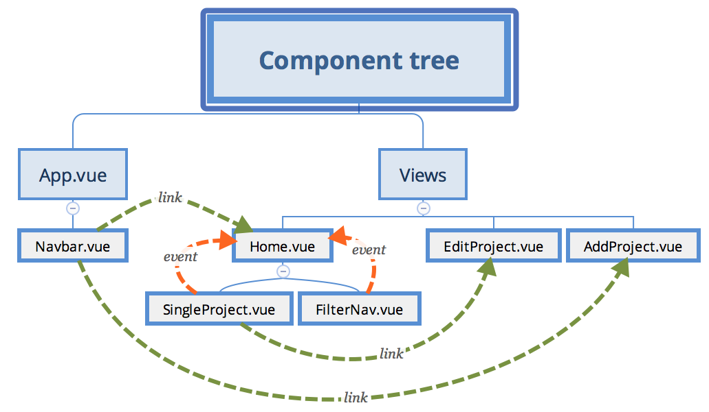
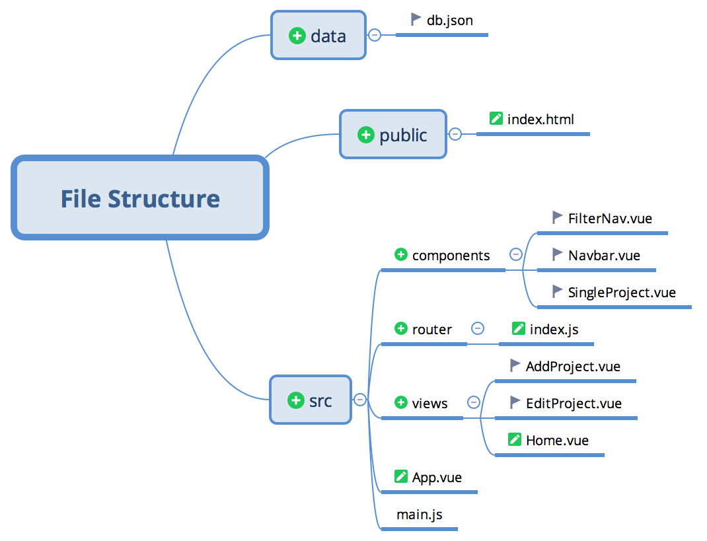

# project-planner
This project is based on one of the many projects developed by [The Net Ninja (Shaun Pelling)](https://www.youtube.com/channel/UCW5YeuERMmlnqo4oq8vwUpg) on his excelent [Udemy course](https://www.udemy.com/course/build-web-apps-with-vuejs-firebase).

## Project Overview

### Home Screen

The home screen shows existent projects as a list of items. Whereas completed projects are marked in green, ongoing projects are marked in pink. The menu on the top of the screen shows available options. The current option is underlined in green. Between the top menu and the project list is the filter. The current filter shows all projects, but one can choose to see only the completed or ongoing projects.

### Project Item

Each single project item can be expanded to show the details by clicking on the project title. A project can be edited, deleted or marked as completed by using the icons on the right-hand side.

### Editing Project

By clicking on the pencil icon, the EditProject view is loaded with the current project data. When the button _Update Project_ is clicked, the project data is updated.

### Deleting Project
The trash icon deletes the targeted project. There is no confirmation before deleting.

### Changing Project Completion Status

A project may be set as completed or ongoing. The left-hand border colour identifies the project completion status. The check icon is also coloured differently to identify the completion status. In addition, the check icon can be used to change the status.

### Adding a New Project

The main menu enables adding a new project by clicking in the corresponding option. It loads the _AddProject_ view. Both fields are required although there is no other check. The _Add Project_ button stores the data in the local database.

## Views & Components Overview

Using Vue 3, the project consists of a root (App.vue, as always) and three child views: Home, AddProject and EditProject (.vue). The root view also has a navbar (Navbar.vue) whereas the Home view has two child components: FilterNav and SingleProject (.vue).

## Views & Components Details

### Views
* _Home_
* _AddProject_
* _EditProject_

### Components
* _NavBar_
* _SingleProject_
* _FilterNav_

## File Structure

## Dependencies

## Data
